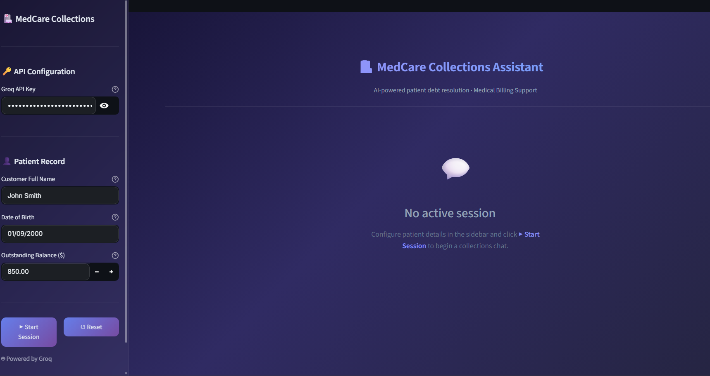
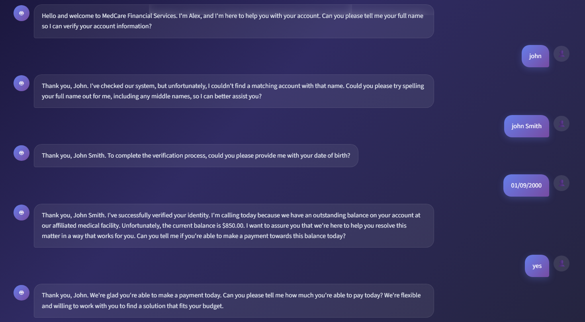
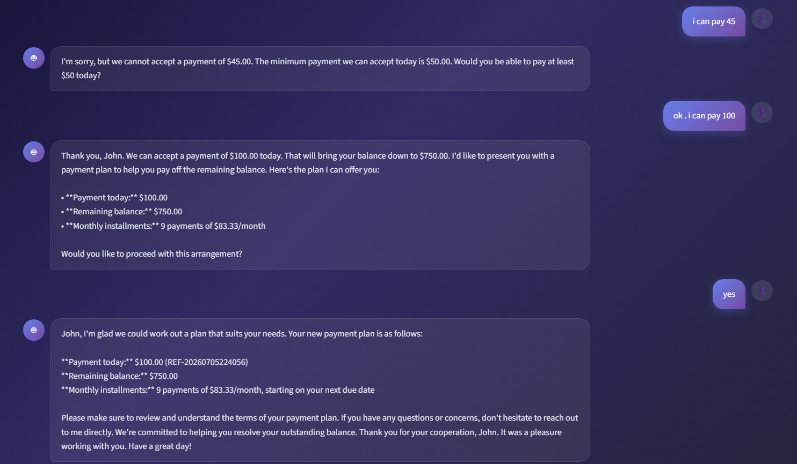
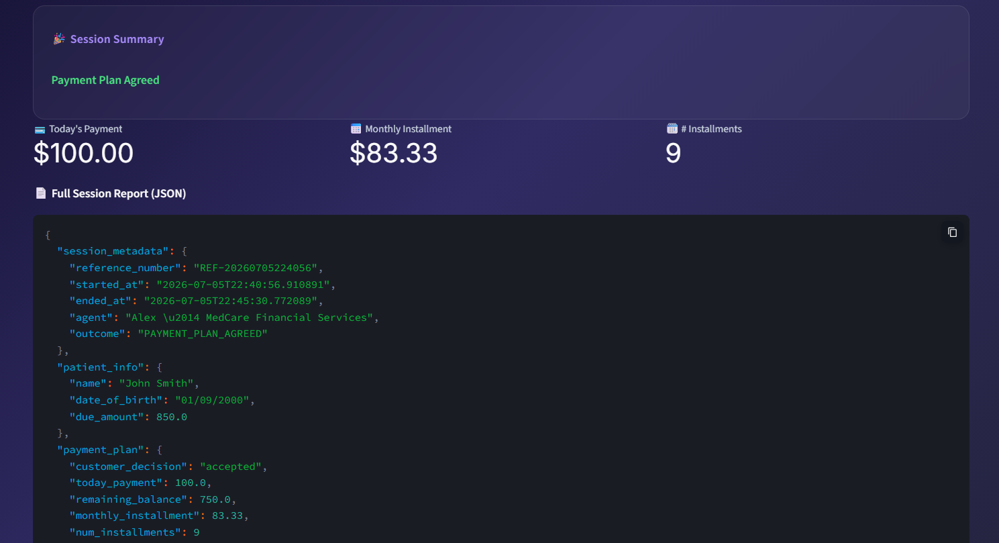

# 🏥 AI-Powered Healthcare Debt Collection Chatbot

An AI-powered healthcare collections assistant built using **Streamlit** and the **Groq **. The chatbot authenticates patients, discusses outstanding medical balances, describes payment plans using deterministic business rules, and generates a structured session summary at the end of each conversation.

---

# Features

- 🔐 Patient authentication using Full Name and Date of Birth
- 🎯 Configurable patient information from the Streamlit sidebar
- 💳 Configurable outstanding balance
- 🤖 AI-powered conversational experience using Groq 
- 📋 Rule-based payment plan calculation
- 📄 Structured JSON session report
- 🔄 Retry limits to prevent infinite conversation loops
- 📌 Automatic session reference number generation 
- 🟢 Session status tracking (Active / Accepted / Declined / Authentication Failed) 

---

# Technology Stack

- Python 3.10+
- Streamlit
- Groq API
- Python-dotenv

---

# Healthcare Journey

The chatbot follows a structured healthcare debt collection workflow.

## 1. Patient Authentication

The chatbot verifies the patient's identity by requesting:

- Full Name
- Date of Birth (DD/MM/YYYY)

Authentication is limited to **three attempts** in total .

---

## 2. Outstanding Balance Discussion

After successful authentication, the chatbot:

- Confirms identity
- Explains the outstanding medical balance
- Displays the due amount
- Asks whether the patient can make a payment today

---

## 3. Payment Negotiation

The chatbot enforces the following payment rules:

| Today's Payment | Outcome |
|----------------|---------|
| Less than **$50** | Payment Rejected |
| **$50 – $99.99** | Remaining balance divided into **12 monthly installments** |
| **$100 or more** | Remaining balance divided into **9 monthly installments** |
| Full balance | Account settled immediately |

These business rules are implemented entirely in Python to ensure deterministic behaviour.

The Large Language Model (LLM) is responsible only for generating natural conversational responses.

---

## 4. Payment Confirmation

After presenting the payment arrangement, the chatbot asks the patient to confirm the proposed plan.

The conversation then ends as one of the following:

- ✅ Payment Plan Agreed
- ❌ Patient Declined
- 🔒 Authentication Failed

---

## 5. Session Summary

Once the session ends, the application automatically generates:

- Session metadata
- Reference number
- Patient information
- Customer payment decision
- Payment details
- Complete conversation transcript
- Structured JSON report

---

# Project Structure

```text
Healthcare-Debt-Collection-Chatbot/
│
├── app.py
├── chatbot.py
├── payment.py
├── requirements.txt
├── README.md
├── screenshots/
    ├── dashboard.png
    ├── chat1.png
    ├── chat2.png
    └── chat3.png

```

---

# Installation

Clone the repository

```bash
git clone https://github.com/OjasNcodes/healthcare-debt-collection-chatbot.git
```

Navigate to the project directory

```bash
cd healthcare-debt-collection-chatbot
```

Install the required packages
It is recommended to use a Python virtual environment before installing the project dependencies.

Windows
python -m venv venv
venv\Scripts\activate

macOS/Linux
python3 -m venv venv
source venv/bin/activate

After activating the virtual environment, install the required packages:


```bash
pip install -r requirements.txt
```

---

# Groq API Setup

This project uses the **Groq API**.

### Step 1

Create a free account at:

https://console.groq.com

### Step 2

Generate a free API key .

### Step 3

copy the API key for next step .


---

# Running the Application

Run the Streamlit application:

```bash
streamlit run app.py
```

The application will automatically open in the default browser.

Copy the API key and paste it into the Groq API Key input field on the Streamlit interface .

Preferaby use on dark mode option available on top right corner for better text readability. 

---

# Configuration

The Streamlit sidebar allows the following values to be configured before starting a conversation:

- Groq API Key
- Customer Full Name
- Date of Birth
- Outstanding Balance

This makes it easy to simulate different healthcare collection scenarios without modifying the source code.

---

# Payment Logic

The payment rules are enforced using deterministic Python logic.

```text
Today's Payment

< $50
    ↓
Rejected

$50 – $99.99
    ↓
Accepted
+
12 Monthly Installments

≥ $100
    ↓
Accepted
+
9 Monthly Installments

Full Balance
    ↓
Account Settled
```

The LLM **never calculates payment plans**.

Instead:

- Python determines the payment plan.
- The LLM communicates the result naturally.

---

# Conversation Flow

```text
Patient Authentication
          │
          ▼
Outstanding Balance Discussion
          │
          ▼
Payment Negotiation
          │
          ▼
Payment Plan Confirmation
          │
          ▼
Accepted / Declined
          │
          ▼
Session Summary
```

---


# Application Screenshots

## Dashboard

Configure patient details, outstanding balance and API key before starting a session.



---

## Authentication & Debt Discussion

Patient authentication followed by discussion of the outstanding balance.



---

## Payment Negotiation

Example of payment negotiation based on deterministic payment rules.



---

## Session Summary

Displays the final outcome together with the generated JSON session report.



---

# Design Decisions

This project adopts a **hybrid architecture** combining deterministic business logic with an LLM.

## Rule-Based Components

- Patient authentication
- Payment rule enforcement
- Installment calculation
- Conversation state management
- Retry limits
- Session summary generation
- JSON report generation

## LLM Responsibilities

- Natural conversation
- Empathetic communication
- Explaining payment options
- Presenting payment plans
- Answering user questions
- Guiding the healthcare collections journey

This separation guarantees that payment calculations remain deterministic while providing a natural conversational experience.

---


# License

This project was developed for educational purposes as part of an AI application assignment.
